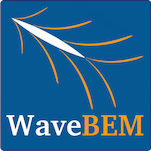

# WaveBEM: Nonlinear Unsteady Potential Flow Solver for Ship-Wave Interaction Problems 

Copyright (C) 2012 -- 2016 by Andrea Mola (1) and Luca Heltai (2)

(1) Scuola Internazionale Superiore di Studi Avanzati
    E-mail: andrea.mola@sissa.it

(2) Scuola Internazionale Superiore di Studi Avanzati
    E-mail: luca.heltai@sissa.it

Main Contributors:

https://github.com/mathlab/WaveBEM/graphs/contributors

**WaveBEM** is an opensource software for ship hydrodynamics simulations currently under development at SISSA mathLab (http://mathlab.sissa.it).

WaveBEM is devoted to the fast evaluation of the total drag of ship hulls operating in both wet and dry transom stern conditions, in calm or wavy water, based on the combination of an unsteady semi-lagrangian potential fow formulation with fully non-linear free surface treatment, experimental correlations and simplifed viscous drag modeling. 

The implementation is entirely based on open source libraries. The spatial discretization is solved using a streamline upwind Petrov-Galerkin stabilization of an iso-parametric, collocation based, Boundary Element Method (BEM), implemented using the open source library **deal.II** (http://www.dealii.org).

The resulting nonlinear differential-algebraic system is integrated in time using implicit Backward Differentiation Formulas (BDF), implemented in the open source library **SUNDIALS** (http://computation.llnl.gov/projects/sundials-suite-nonlinear-differential-algebraic-equation-solvers/sundials-software). 

The **OpenCASCADE** library (http://www.opencascade.com/) is used to interface the model directly with CAD data structures. **WaveBEM** accounts automatically for hulls with a transom stern, both in wet and dry regimes, by employing a specifc treatment of the free surface nodes on the stern edge, that automatically detects when the hull advances at low speeds. 

In this case the transom stern is partially immersed, and a pressure patch is applied on the water surface detaching from the transom stern, to recover the gravity effect of the recirculating water on the underlying irrotational fow domain.

The official distribution is on GitHub, and you can clone the
repository using

	git clone https://github.com/mathlab/WaveBEM.git

This software is subject to LGPL version 2.1 or later and may not be
distributed without copyright and license information. Please refer to
section 5 and 6 of this file for further information on this license.

A detailed documentation constructed using Doxygen is accessible here:

http://mathlab.github.io/WaveBEM

1. Requirements
===============

Currently, the distributed source code requires version 8.4 of the deal.II library, compiled with OpenaCASCADE interface enabled, as well as version 1.0 of the deal2lkit library (http://mathlab.github.io/deal2lkit), compiled with SUNDIALS interface enabled.

2. Installation procedure
=========================

Clone (or fork) the WaveBEM repository using

	git clone https://github.com/mathlab/WaveBEM.git

**WaveBEM** can then be compiled by running

	mkdir build
	cd build
	cmake -DDEAL_II_DIR=/path/to/deal.II -DDEAL2LKIT_DIT=/path/to/deal2lkit ..
	make

and tested using

	make setup_tests
	ctest

You can modify the resulting `CMakeCache.txt` to set a different installation path, or you can call cmake with the additional option `-DCMAKE_INSTALL_PREFIX=/path/to/install/dir`, to install the executable on your system after compilation.

3. Extensive documentation
==========================

A browsable documentation of **WaveBEM** is available at

http://mathlab.github.io/WaveBEM

If the user has the program Doxygen installed, this documentation can
be compiled for offline browsing by building the `doc` target (only
available if Doxygen was found during configure time):

	make doc

In this case, the documentation will be accessible in the subdirectory

	doc/html

If the user wants the deal.II documentation to be inlined, then the
file http://www.dealii.org/developer/doxygen/deal.tag should be
downloaded to the building directory before making the documentation,
for example, using wget

	wget http://www.dealii.org/developer/doxygen/deal.tag
	make doc

4. Citing this work
===================

If you use this software, please consider citing the following works:

	@article{MolaHeltaiDeSimone-2013-a,
	Author = {Andrea Mola and Luca Heltai and Antonio DeSimone},
	Journal = {Engineering Analysis with Boundary Elements},
	Number = {1},
	Pages = {128 - 143},
	Title = {A stable and adaptive semi-Lagrangian potential model for unsteady and nonlinear ship-wave interactions},
	Volume = {37},
	Year = {2013}}

	@article{GiulianiMolaHeltai-2015-a,
	Author = {Nicola Giuliani AND Andrea Mola AND Luca Heltai AND Luca Formaggia},
	Journal = {Engineering Analysis with Boundary Elements},
	Pages = {8-22},
	Title = {FEM SUPG stabilisation of mixed isoparametric BEMs: application to linearised free surface flows},
	Volume = {59},
	Year = {2015}}

	@article{BangerthHeisterHeltai-2016-a,
	Author = {Wolfgang Bangerth and Timo Heister and Luca Heltai and Guido Kanschat and Martin Kronbichler and Matthias Maier and Bruno Turcksin},
	Journal = {Archive of Numerical Software},
	Number = {100},
	Pages = {1--11},
	Title = {The deal.II library, Version 8.3},
	Volume = {4},
	Year = {2016}}

	@techreport{SartoriGiulianiBardelloni-2015-a,
	Author = {Alberto Sartori and Nicola Giuliani and Mauro Bardelloni and Luca Heltai},
	Institution = {SISSA},
	Number = {57/2015/MATE},
	Title = {deal2lkit: a Toolkit Library for deal.II},
	Year = {2015}}

	@inproceedings{MolaHeltaiDesimone-2014-a,
	Author = {Mola, Andrea and Heltai, Luca and Desimone, Antonio},
	Booktitle = {The 24th International Ocean and Polar Engineering Conference},
	Title = {{A fully nonlinear potential model for ship hydrodynamics directly interfaced with CAD data structures}},
	Year = {2014}}

	@inproceedings{MolaHeltaiDesimone-2015-a,
	Author = {Mola, Andrea and Heltai, Luca and Desimone, Antonio},
	Booktitle = {18th International Conference on Ships and Shipping Research},
	Title = {{Nonlinear free surface potential flow simulations for hulls with a transom stern operating in dry and wet conditions}},
	Year = {2015}}

5. Licence Information
======================

See the LICENCE file in this directory.

